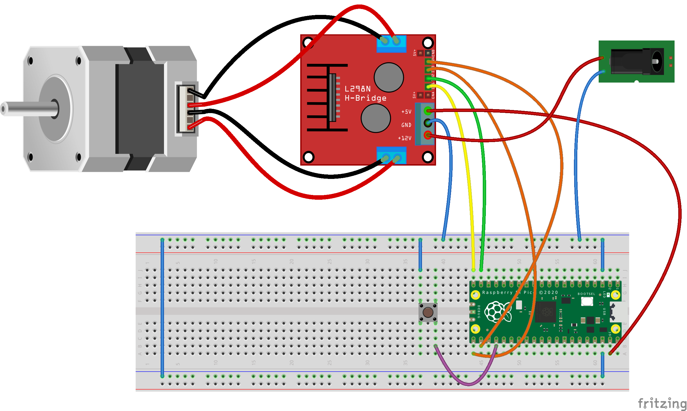

# shutter_meta_tester
A project which goal is to test the accuracy of shutter speed measurement tools.  

The general idea is to produce a well controlled shutter-like device.  
This device is used to produce a controlled open time, tested with a tool such as Shutter Speed Tester.  

If the measurement result of the tool is the same as the expected value, the measurement tool is accurate.  
The point is now to produce a well controlled open time. The target times are from 1s to 1/4000s.  

We consider two ways to simulate a shutter.  
1. The more theretical is to produce a "time slot" shutter. This kind of shutter consists in a source light that is lit during a controlled duration. This kind of shutter doesn't take into account the geometrical aspect of real shutter. However, it is a good mean to check the result (and its potential bias) due to the electronic circuit of the tester. The obtained results have to be taken with a "grain of salt" as the shutter testers usually come with their own light source.  
2. A simulated shutter more close to focal plane shutters (curtain shutters) consists in creating a slot that translates at a speed similar to real shutters. This can be achieved by creating a rotating wheel, with a well controlled rotation speed.

# Time Slot shutter

## Description

The faster shutter speed we want to measure is 1/4000s = 250 micro seconds.  
Because the response time of an LED is very fast (about 10 nano seconds), it is possible produce a very well controlled light pulse using a microcontroler that lights on and off an LED. The pulse duration precision is induced by the precision of the microcontroler that controls the LED.  

## Pros/cons

- The pros
  - Easy to build
  - Easy to control the pulse duration
  - Can differentiate a potential bias due to the electronic circuit from the bias due to geometrical consideration
- The cons
  - Does not take into account the physical phenomenos induced by a physical shutter.     

## Schema  

And the code is here :  
[Shutter Meta Tester Code](shutter_meta_tester/shutter_meta_tester.ino)

Usage :  

---

# Rotating wheel method
## Description
The idea is to use a wheel that rotates at a controlled frequency. By opening a slot in the wheel, we have the following open time :  

t = d / (2 x Pi x R x F)  

Where  
- t is the opened duration
- d is the size of the slot
- R is the radius from the wheel axis to the hole
- F is the wheel rotation frequency
 
## Pros/cons
- The pros
  - Very close to a real shutter
- The cons
  - A lot of hardware to buy
  - A lot of hardware to control 
  - A lot of parts to 3D print
  
## Schema
We make the choice to control a wheel rotation using a stepper motor. The stepper motor has the advantage to be drivable very precisely, without any further regulation circuit. This stepper motor is controlled using an L298N board. This board is itself driven through the GPIO 14, 15, 16 and 17 of a Raspberry Pi Pico board.  
A push button, connected on GPIO 18, allows to start and stop the motor.  
The whole stuff is powered using a 12V DC adapter. The 5V output of the L298N bard is used to power the microcontroler board.  
The Rpi Pico has been chosen because it is cheap, available, efficient and fun : we can program it using MicroPython language (see [Rpi Pico MicroPython documentation](https://www.raspberrypi.com/documentation/microcontrollers/micropython.html))  
The microPython code used to drive all that is here. 

### Bill Of Material (BOM)  

| Component | Reference|
|---|---|
| Microcontroler | https://www.kubii.fr/cartes-raspberry-pi/3205-raspberry-pi-pico-3272496311589.html#/477-version_pico-pico |
| Stepper motor | https://www.gotronic.fr/art-moteur-17hs15-0404s-18354.htm |
| Motor controller  | https://www.gotronic.fr/art-commande-de-2-moteurs-sbc-motodriver2-27418.htm |
| Power unit | 12V DC adapter (taken from a spare electronic equiment) |

## The Wheel

We make the choice to use a 2.5rps rotation speed. This allows to have a well controlled speed. A strong torke at this speed ensures a great confidence on the speed accuracy.

The camera manufacturer as ... recommends to adjust the shutter translation speed to 12ms for the whole distance (36mm). This means 3m/s.

So we will build our wheel to get a rotating window with the same value for its linear speed

This mean a wheel radius of : v = 2*pi*Rf  
- v=3000mm/s
- pi=atan(-1)
- R=radius
- f=2.5 s-1  

Conclusion : the wheel radius **R=191mm**

The [wheel](design/Wheel.png) is designed using FreeCad 0.20.2 and built using 3D printing.  
It has a central hub, 6 spokes and a rim made of 6 parts. Each part of the rim has 2 open windows.  
11 of the windows are completely masked. The last one has an opening in it that simulates the camera shutters.  
In order to simulate a shutter speed of 1/1000th of a second, the distance between the two sides of the window shall be 3mm.

